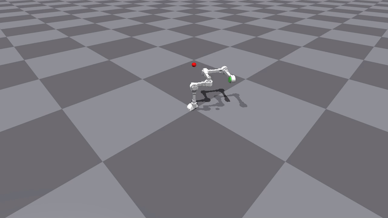
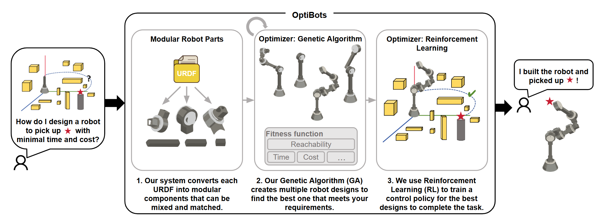
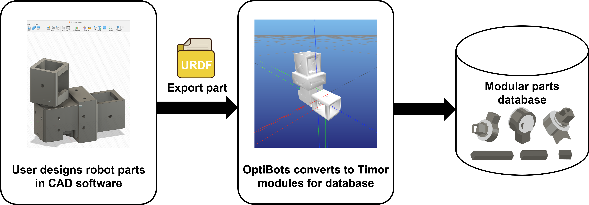
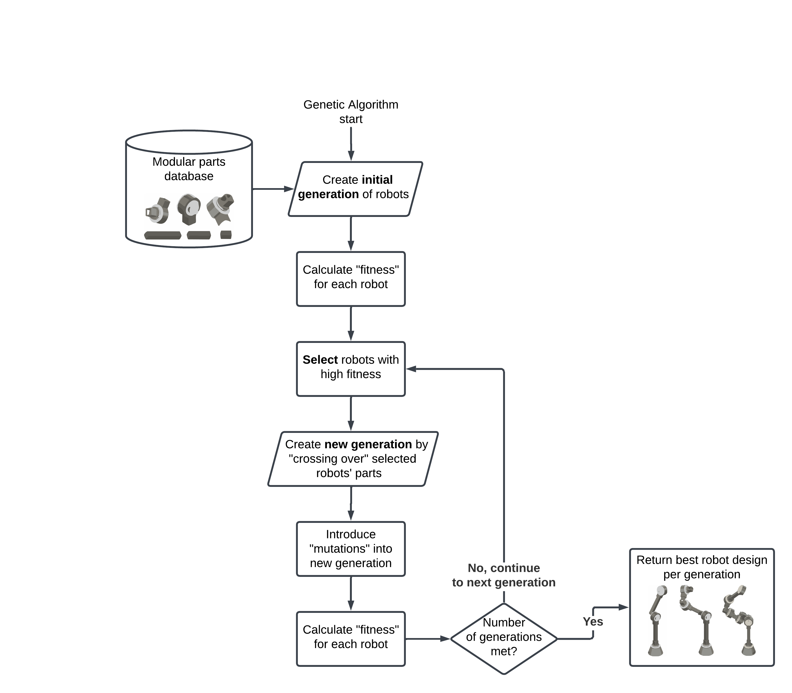
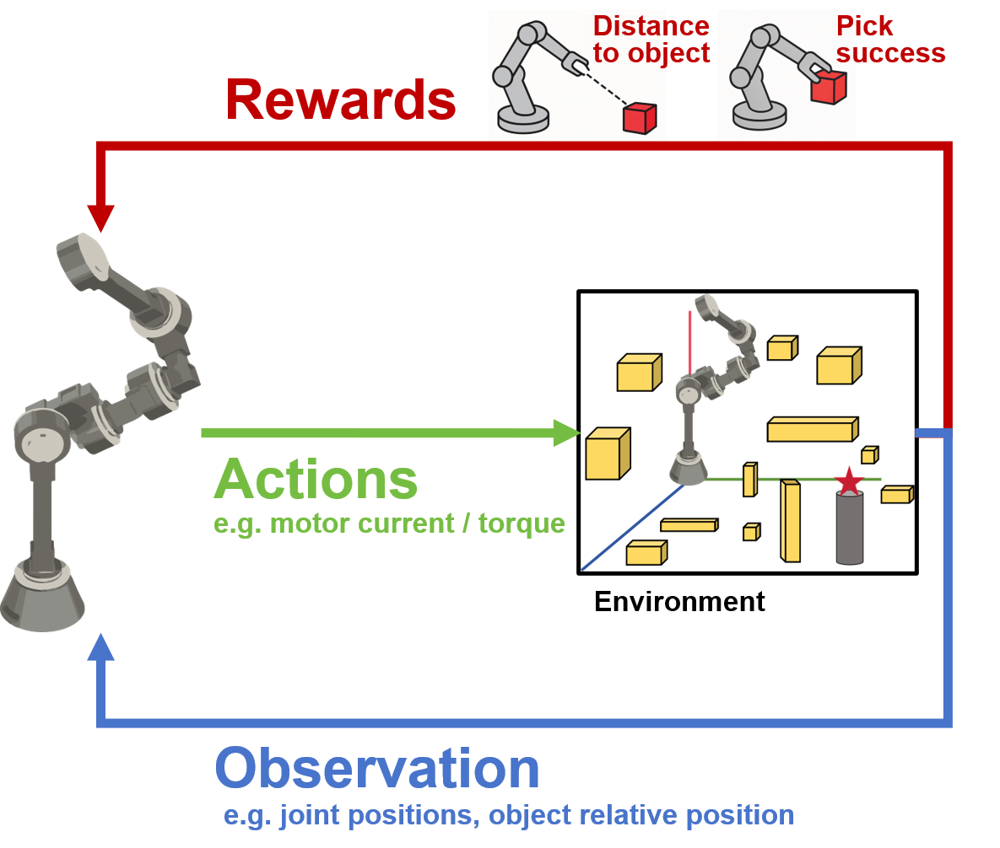
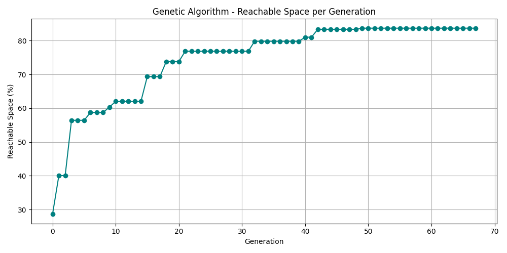

# OptiBots: Modular Robot Design Using Genetic Algorithms
Contributor: [Alexandra Zhang Jiang](https://github.com/Ale-ZJ), [Calix Tang](https://github.com/CalixTang), [Jae Won Kim](https://github.com/parham-sharaf), [Jonas Yunzhe Li](https://github.com/LIYunzhe1408), [Shankar Kailas](https://github.com/shkailas) \
Advisor: Prof. [Masayoshi Tomizuka](https://scholar.google.com/citations?user=8m8taGEAAAAJ&hl=en), Dr. [Wei Zhan](https://zhanwei.site/), [Yuxin Chen](https://thomaschen98.github.io/), [Chenran Li](https://www.linkedin.com/in/chenran-li-b70078197/)

Report: [OptiBots: Modular Robot Design
Using Genetic Algorithms](https://drive.google.com/file/d/10FZ_gAAY2tnsnTH_F4qJB8uyd5-BorPb/view?usp=drive_link)

## Overview
OptiBots is a simulation-based framework for the automated design and control of modular robots. Given a user-defined task and a library of modular parts, our system:
1. Generates optimal robot designs via genetic algorithms.
2. Trains control policies for the designed robot using reinforcement learning.
3. Validates robot behavior in simulation using Isaac Gym and Timor.

This end-to-end pipeline reduces physical prototyping costs and lowers the barrier to rapid robot development.

## Why Need
Traditional robots often struggle to adapt to diverse environments because their designs are fixed, leading to costly and time-consuming modifications for specialized tasks. Modular robots are built from interchangeable parts which offers greater flexibility like choosing Lego pieces from a bucket. However, assembling and controlling these robots remains a challenge.

By enabling users to rapidly iterate through design options without requiring physical prototypes, our approach slashes design and development costs.

## Key Features
* Modular Part Integration: Import custom modules via URDF or use the default part library.
* Genetic Algorithm Optimization: Evolve robot configurations that maximize task-specific fitness.
* Reinforcement Learning: Train control policies using Proximal Policy Optimization (PPO).
* Timor + Isaac Gym: Leverages Timor for modular design and Isaac Gym for high-performance simulation.

Customizability: Users can define their own tasks, fitness functions, and environments.

## How It Works
1. Modular Robot Creation
   * Users define robot components (joints, linkages, etc.) in URDF.
   * Timor parses these into modular units and assembles candidate designs.

2. Genetic Algorithm (GA)
   * Lexicographic GA optimizes for:
      * Reachability
      * Cost
      * Number of joints/modules
      * Reachability is computed using forward kinematics and voxel-based sampling in cluttered environments.

3. Reinforcement Learning (RL)
   * RL environment built using Isaac Gym + Gymnasium API.
   * Control policy trained with PPO from stable-baselines3.
   * Trained robot completes tasks like "move to target" in 3D space.

## Results
* GA converges to high-performing robots (up to 90% reachability).
    
* PPO achieves ~80% success rate on "move-to-goal" task.
* Full simulation stack validated with over 4K parallel environments.

## Install
`git clone` this repo to Desktop and navigate into project root folder.

Run `conda env create -f env.yml`.
Run `conda activate timor-env`

For more details(including results, RL parameters, fitness function for GA and stl to URDF conversion), please review the report [OptiBots: Modular Robot Design
Using Genetic Algorithms](https://drive.google.com/file/d/10FZ_gAAY2tnsnTH_F4qJB8uyd5-BorPb/view?usp=sharing)
