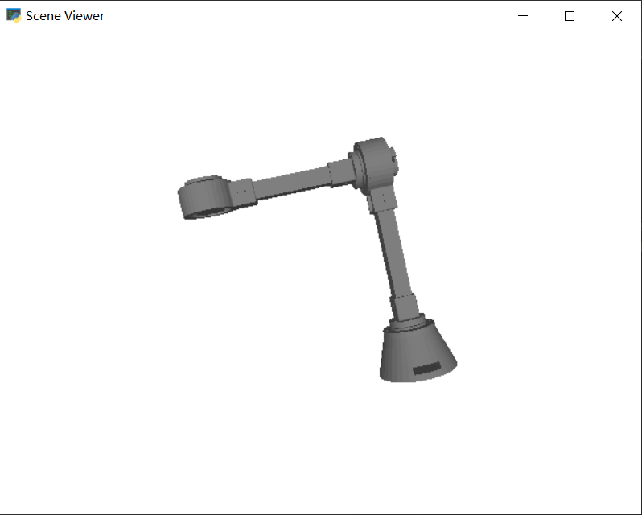
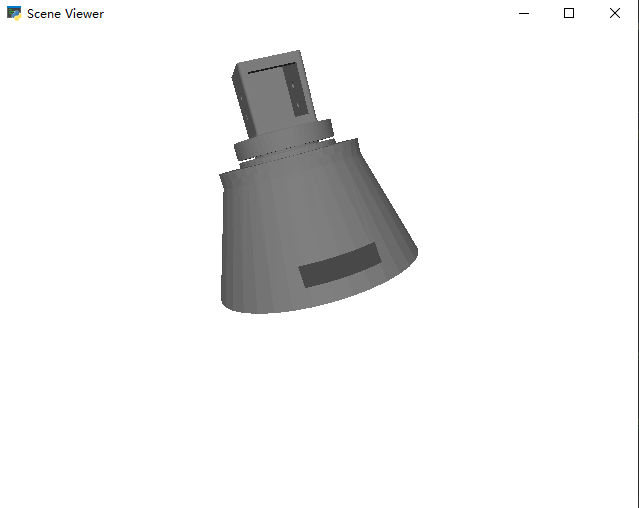
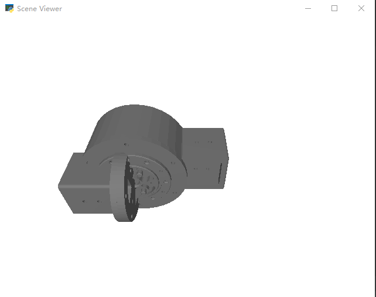
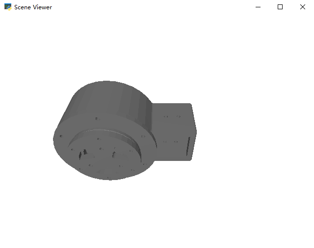

## Next step


## What this folder do
Based on the predefined URDF, implement converting scratch code with urdfpy and animate it to validate.


| URDF Name         | Visualize              |
| :-----------------| :--------------------  | 
| master            | (one way to assembly) 
| Assem_4310_BASE   |  |
| Assem_4310_JOINT  | |
| Assem_4305_JOINT  | |

## How to start
### Take URDF
Simply import the `master.urdf` into simulation environment, say `timor-python`.

### Edit
1. Set up with the `requirement.txt`
   1. cd `/TimorExamples/stl2urdf/`
   2. run `pip install -r requirements.txt`


## Next step
More work is going to be done to determine the assembly method by automatically assign parameters.


## Notes from hardware team 
Size of the hole: 0.025, 0.025, 0.03

### Configuration of different assembly methods
#### config - 1
```xml
<!-- 4310 Joint to rod 2 -->
    <joint name="base_to_joint2" type="fixed">
        <parent link="motor4310_out_link"/>
        <child link="rod_link_2"/>
        <origin xyz="0 -0.0265 -0.0875" rpy="0 0 0"/> <!-- Adjust based on actual position -->
    </joint>
    <joint name="rod_2_to_4305" type="fixed">
        <parent link="rod_link_2"/>
        <child link="motor4305_link"/>
        <origin xyz="0 0 -0.1" rpy="1.5708 0 3.14"/> <!-- Adjust based on actual position -->

    </joint>
```

#### config - 2
```xml
    <!-- 4310 Joint to rod 2 -->
    <joint name="base_to_joint2" type="fixed">
        <parent link="motor4310_out_link"/>
        <child link="rod_link_2"/>
        <origin xyz="0 -0.0875 0" rpy="-1.571 0 0"/> <!-- Adjust based on actual position -->
    </joint>
    <joint name="rod_2_to_4305" type="fixed">
        <parent link="rod_link_2"/>
        <child link="motor4305_link"/>
        <origin xyz="0 0 -0.1" rpy="1.5708 0 3.14"/> <!-- Adjust based on actual position -->

    </joint>
```
